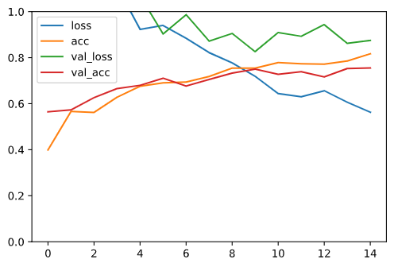
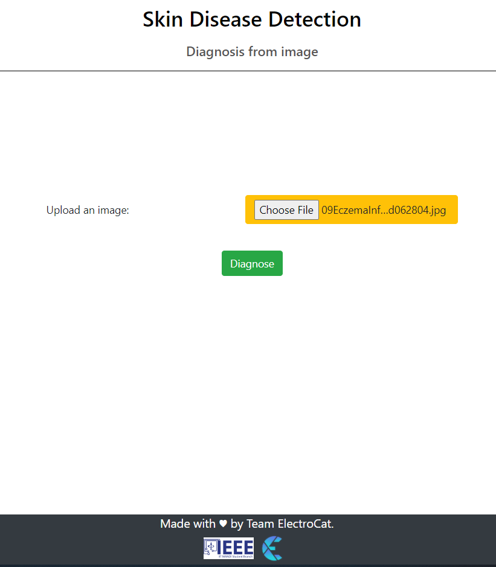
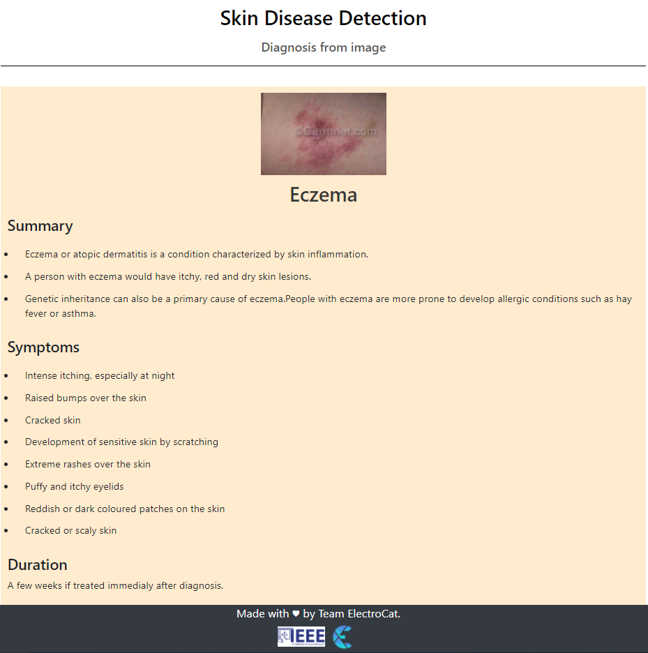
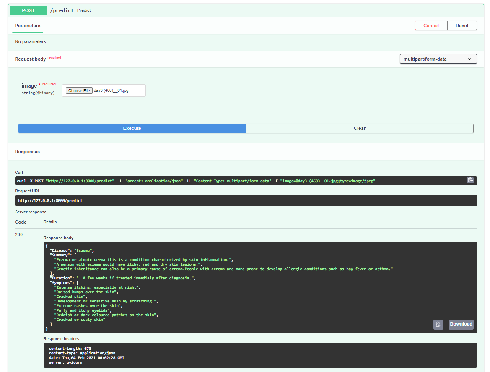

# Skin Disease Detection Using Convolutional Neural Networks
[](https://forthebadge.com)
[](https://forthebadge.com)


This is our submission for Electrothon 3.0 as a framework for Skin Disease Detection that analyses the skin pigmentation using Convolutional neural network for diagnosis of skin diseases. Detailed problem statement can be found [here](https://www.notion.so/Organizational-Problem-Statements-ac0bd0cea6a44920ab845dc8f72379b1#ec0c8cacba5846faa9323feecdcd9959).

## Authors

 - [Mukul Thakur](https://github.com/Mukulthakur17)
 - [Akash Rana](https://github.com/akaxhrana)
 - [Kashish Srivastava](https://github.com/cannibalcheeseburger)

## Overview

We have trained a Convolutional Neural Network on an extensive training dataset of images of skin diseases and rashes to classify the input as one of the 8 categories of diseases. We achieved 81.68% training accuracy and 75.56% validation accuracy upon training the neural network.\
The 8 different catagories of skin diseases that we have selected are:
- Acne Cystic
- Eczema
- Impetigo
- Psoriasis
- Rosacea
- Schamberd
- Allergic Contact Dermatitis
- Tinea Ringworm Groin

## Accuracy-Loss Curve


## Installation

### Build from Source
Clone the repository and checkout to stable commit

```
git clone https://github.com/Mukulthakur17/Skin-Pigment-Analysis.git
cd electrothon
```

### Install Requirements

```
pip install -r requirements.txt
```

### Preparing the model

 - Download the trained model from [here](https://drive.google.com/drive/folders/1ngX9KB--Fon0YmuCgfta6cjeCSamq0g_?usp=sharing "Google Drive").
 - Move it to the directory "Model Weights _ Json".

### Starting the uvicorn server

After installing requirements 

```
uvicorn main:app
```
This would start the ASGI server at http://127.0.0.1:8000.

## Using Front-End

 - After starting the server open http://127.0.0.1:8000 in your browser.
 - Upload the image that you want to examine for diseases.
 - Click Diagnose
 - Detailed log of Disease predicted by the neural networks and its symptoms and duration will pop up

 
 


## Using API Directly

Request URL:
```
 http://127.0.0.1:8000/predict

```

Using Swagger UI:
 - After starting the server open http://127.0.0.1:8000/docs in your browser to open the swagger UI for APIs.
 - Scroll down to Post /predict
 - Click Try it Out
 - Chose file to upload for classification 
 - Click Execute
 - Under Responses section , a detailed log of disease, summary ,symptoms and duration will be displayed in json format as the response 



